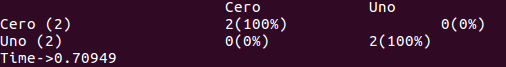
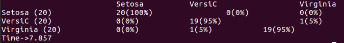
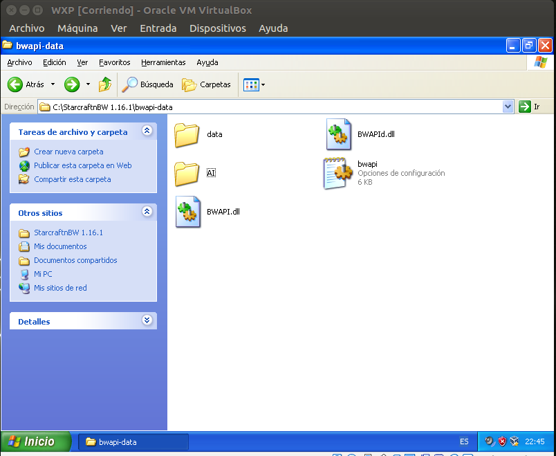
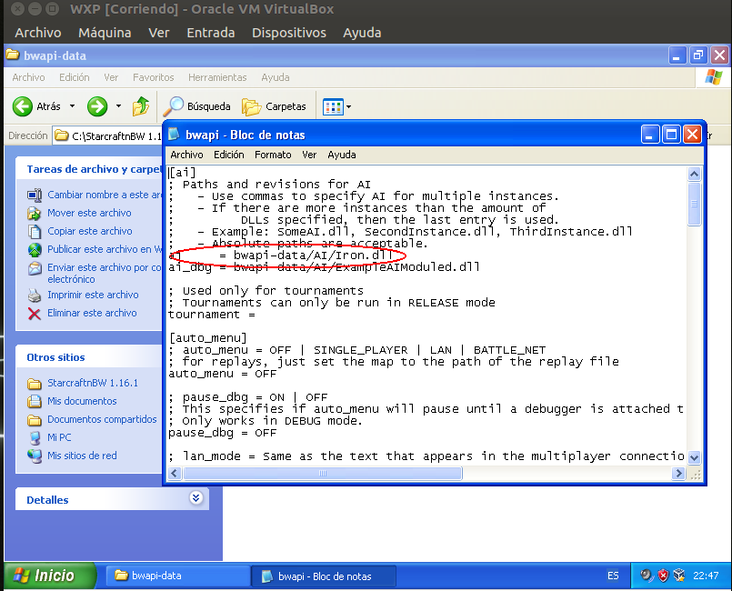
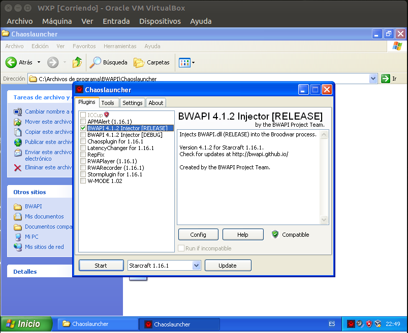
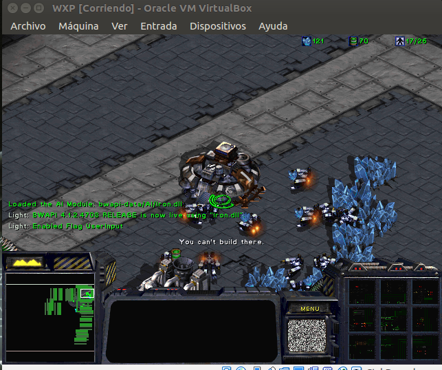

# Back Propagation
Red Neuronal con Back Propagation para el curso de Tópicos de IA (Christofer Fabián Chávez Carazas)

## Código Fuente y Compilación

El código fuente del programa se encuentra en la carpeta src. Aquí también hay un archivo "compile.sh" con el comando utilizado para compilar el programa. Al compilarlo, se genera un archivo "run" en la carpeta raiz.

## Formato de los archivos de datos

El programa recibe como parámetro dos archivos con los datos de entrenamiento y de prueba. Los dos tienen el mismo formato: Las propiedades son separadas por comas y cada registro es separado por un salto de línea. A continuación se muestra un ejemplo de estos archivos con la base de datos Iris:

```
0.542857142857,0.263157894737,0.719298245614,0.583333333333,2.0
0.485714285714,0.157894736842,0.80701754386,0.541666666667,2.0
0.942857142857,0.368421052632,0.894736842105,0.916666666667,2.0
0.542857142857,0.578947368421,0.80701754386,0.958333333333,2.0
0.571428571429,0.421052631579,0.789473684211,0.708333333333,2.0
0.457142857143,0.368421052632,0.666666666667,0.708333333333,2.0
0.714285714286,0.421052631579,0.771929824561,0.833333333333,2.0
0.657142857143,0.421052631579,0.80701754386,0.958333333333,2.0
0.714285714286,0.421052631579,0.719298245614,0.916666666667,2.0
```

## Formato del archivo de configuración

El programa recibe como parámetro un archivo con toda la configuración de la red neuronal. Este archivo tiene el siguiente formato:

```
<Número de Propiedades> <Número de Clases> <Número de Capas>
<Número de Neuronas de la Capa 1> <Número de Neuronas de la Capa 2> ... <Número de Neuronas de la Capa n>
<ID de la función de Activacion 1> <ID de la función de Activacion 2> ... <ID de la función de Activacion n>
<Nombre de la Clase 1> <Nombre de la Clase 2> ... <Nombre de la Clase n>
```

El programa soporta tres funciones de activación. Las IDs son la siguientes:

* Función Signoide - 0
* Función Tangente Hiperbólica - 1
* Función ReLU - 2


Un ejemplo para la base de datos Iris es el siguiente:

```
5 3 3
5 5 3
2 0 0
Setosa VersiC Virginia
```

El número de propiedades incluye también la clase, en este caso son cinco propiedades. El número de clases es tres (0,1,2). Se van a crear tres capas con cinco, cinco y tres neuronas cada una. Las funciones de activación de cada capa son ReLU, Signoide y Signoide. Y al final se da el nombre de las clases. Esto último es para generar una matriz de confución al termino de la ejecución del programa.

## Ejecución

Los parámetros que recibe el programa son los siguientes:

```
> ./run <Archivo de Configuración> <Archivo Training> <Archivo Test> <Número de Iteraciones>
```

## Ejemplos

Todos los archivos utilizados para los ejemplos se encunetran en este repositorio.

### XOR

Ejecución:

```
>  ./run configXor xorTraining xorTest 10000
```
Resultado:



### Iris

Ejecución:

```
> ./run configIris irisN.dat testIrisN.dat 5000
```

Resultado:



# Configuración del API de StarCraft

## Requerimientos

* Se utilizó una máquina virtual con Windows XP. 
* Se utilizó el StarCraftBW portable en la versión 1.16.1
* El API que se usó es el del siguiente repositorio: https://github.com/bwapi/bwapi
* Se utilizó la versión 4.1.2 de la api ya que es la más estable y la versión más actualizada causaba problemas con la versión de Windows de la máquina virtual.
* Para las pruebas se utilizó el Bot "Iron", que se puede encontrar en el siguiente sitio: https://sscaitournament.com/index.php?action=scores

## Instalación

* Como el StarCraft es portable, puede ser colocado en cualquier directorio de la máquina virtual.
* Se ejecuta el instalador de la API.
* Se le dice la ubicación del StarCraft y se espera hasta que termine la instalación.

## Configuracin y ejecución

* Entrar a la carpeta del StarCraft y luego a la carpeta "bwapi-data". Aquí es donde se pondrán las IAs y se configurará la API.



* Se crea la carpeta AI y se coloca el Bot "Iron" dentro.
* Se abre el archivo bwapi y se coloca el nombre del Bot "Iron" como la IA que se va a inyectar.



* Entrar a la carpeta donde se instaló el API y ejecutar el programa "Chaoslauncher".
* Marcar la casilla "BWAPI 4.1.2 Injector RELEASE.



* Ejecutar el Inyector.
* Entrar en Single Player > Expansion > Escojer un Usuario > Play Custom. Elegir un mapa cualquiera y elegir la raza terrans, ya que el Bot "Iron" sólo funciona con esa raza.
* Esperar a que gane la IA.




